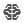
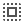

# About the icons in this folder

The icons in this folder were generated from [fonts.google.com/icons](https://fonts.google.com/icons). They can also be found in the repo [github.com/google/material-design-icons](https://github.com/google/material-design-icons). The `LICENSE` of the Google Material Design Icons is Apache 2.0 and is copied in this current folder. Therefore, InsightSolver can redistribute the icons in this folder:
-  `attach_money.svg`
-  `gondola_lift.svg`
-  `network_intelligence.svg`
-  `offline_bolt.svg`
-  `select_all.svg`
-  `sell.svg`
-  `shuffle.svg`
-  `timelapse.svg`
-  `zoom_out_map.svg`

The reason why the SVG files are included here is to avoid needing an internet connection when generating the scores banner in the function `visualization/generate_insightsolver_banner`.

# About the fonts in this folder

This folder also contains fonts:
- `Roboto-Regular.ttf`
- `Roboto-Bold.ttf`
These were downloaded from `https://fonts.google.com/specimen/Roboto/`.
The licence for `Roboto` is `SIL Open Font License (OFL) 1.1` and is joined here in the file `OFL.txt`.